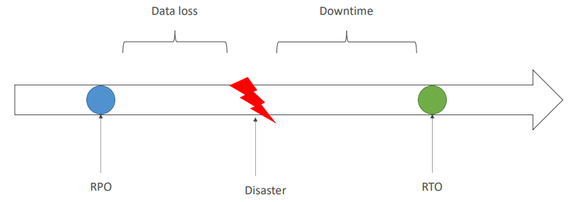
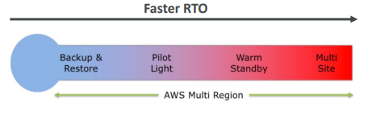
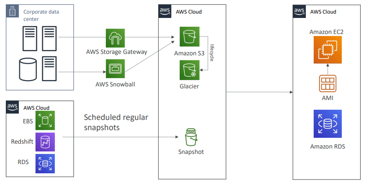
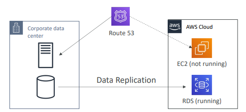
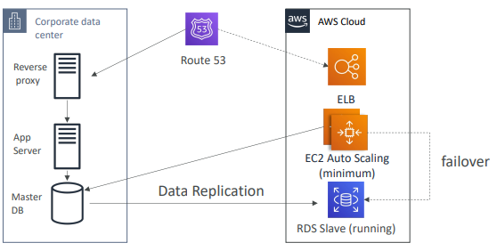
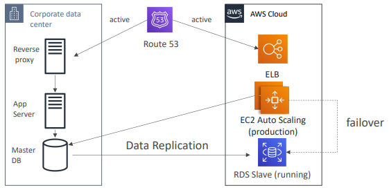
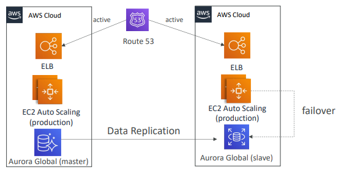

# learn-cloud-aws-several-services

Repositório para estudos de serviços AWS de diversos assuntos, como Machine Learning, Migração e Transferência de Dados, Segurança e etc

---

**Disaster Recovery e Migração**

* [Database Migration Service](./dms/)
* [Application Discovery Service](./app_discovery/)
* [Application Migration Service - MGN](./mgn/)

---

## 1. Disaster Recovery na AWS

Qualquer evento que tenha um impacto negativo na continuidade dos negócios da empresa é um desastre.

Disaster Recovery (DR) é a preparação se recuparar de um desastre.

Que tipo de Diaster Recovery?

* On-Premises => On-Premises> DR tradicional e muito caro;
* On-Premises => AWS: recuperação híbrida;
* AWS Region A => AWS Region B

Definição de termos:

* **RPO:** Recovery Point Objective - o quão frequente você realiza backups, o quanto tempo no passado você consegue voltar com seus backups;
* **RTO:** Recovery Time Objective - quando você se recupera de um desastre.

---

### 1.1. Estratégias de Disaster Recovery

* Backup e Restore
* Pilot Light
* Warm Standby
* Hot Site / Multi Site Approach

**Backup e Restore (alto RPO)**

Você realiza backups (snapshots, AMIs) na nuvem, e quando precisa, recria seus recursos a partir dos backups.

O único custo envolvido é o armazenamento dos backups, é a estratégia mais simples e barata, mas a mais demorada (alto RPO e RTO).

**Pilot Light**

Uma versão menor da aplicação está sempre rodando na nuvem para suas aplicações críticas. É parecido com backup e restore, porém seus sistemas críticos aqui já estão em execução (mais rápido).

Baixo RTO e RPO.

**Warm Standby**

O sistema todo está em execução, porém em um tamanho mínimo. Quando ocorre um desastre, é possível escalar para a carga de produção.

RTO e RPO ainda mais baixos, porém mais caro porque as instâncias ficam em execução.

**Multi Site/ Hot Site Approach**

Tem o menor RTO (minutos ou segundos) e RPO, porém é o mais caro. Escala total de produção está em execução na AWS e On Premises (duplicado).

**All AWS Multi Region**

---

## 2. Estratégias On-premises com AWS

---