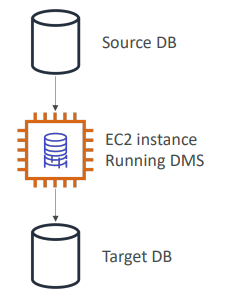
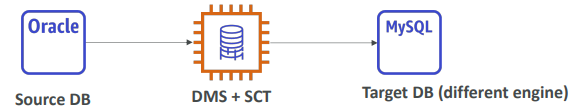
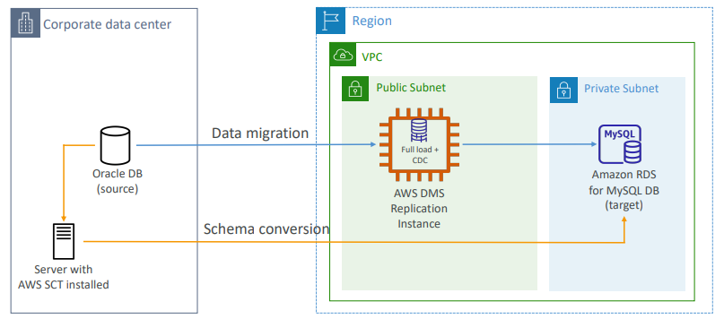
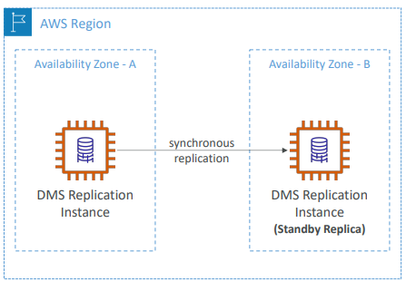

# DMS - Database Migration Service

Faz a migração da bancos de dados para a AWS de forma segura e rápida.

O database de origem permance disponível durante a migração.

Suporta:

* **Migrações Homogêneas:** mesma engina (ex.: Oracle -> Oracle);
* **Migrações Heterogêneas:** engines diferentes (ex.: Micrososft SQL Server -> Aurora).

Faz replicação contínua com CDC (Change Data Capture).

Você deve criar instâncias EC2 para executar as tasks de replicação.

**Sources:**

* On-premises e databases em instâncias EC2: Oracle, MS SQL Server, MySQL, MariaDB, PostgreSQL, MongoDB, SAP, DB2;
* Azure: Azure SQL Database;
* Amazon RDS: todos, incluindo Aurora;
* Amazon S3;
* DocumentDB.

**Targets:**

* On-premises e databases em instâncias EC2: Oracle, MS SQL Server, MySQL, PostgreSQL, SAP;
* Amazon RDS;
* Redshift, DynamoDB, S3;
* OpenSearch Service;
* Kinesis Data Streams;
* Apache Kafka;
* DocumentDB e Amazon Neptune;
* Redis e Babelfish.

---

## AWS Schema Conversion Tool (SCT)

Converte o seu schema de database de uma engine para outra.

* Exemplo OLTP: SQL Server ou Oracle para MySQL, PostgreSQL, Aurora;
* Exemplo OLAP: Teradata ou Oracle para Amazon Redshift.

Utilize instâncias `compute-intensive` para otimizar as conversões de dados.

Você só precisa utilizar SCT em migrações heterogêneas.

---

## Continuous Replication

---

## Multi-AZ Deployment

---

## RDS e Aurora MySQL Migrations

> A discussão é semelhante para PostgreSQL.

**RDS MySQL para Aurora MySQL**

* Opção 1: DB Snapshot do RDS MySQL e restore como MySQL Aurora DB;
* Opção 2: Criar um Aurora Read Replica a partir do RDS MySQL, e quando o replication lag for zero, promovê-lo para DB Cluster (leva mais tempo e é mais caro);

**MySQL Externo para Aurora MySQL**

* Opção 1:
    * Use `Percona XtraBackup` para criar um arquivo de backup no Amazon S3;
    * Crie o Aurora MySQL DB a partir do S3.

* Opção 2:
    * Crie um Aurora MySQL DB
    * Use o `mysqldump utility` para migrar MySQL para o Aurora (mais lento que o método do S3).

> Use o DMS se os dois databases estão no ar em execução.