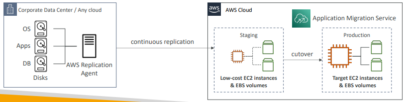

# AWS Application Migration Servicen (MGN)

Solução de Lift-and-shift (rehost) que simplifica a migração de aplicações para AWS.

Converte seus servidores físicos, virtuais e cloud-based para rodar nativamente na AWS.

