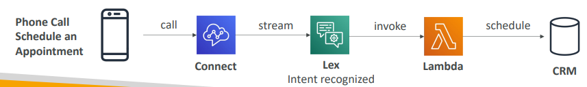
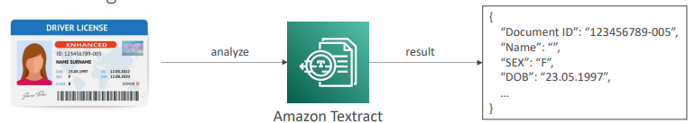

# Serviços de Machine Learning

Resumo sobre serviços de Machine Learning da AWS.

* Rekognition: face detection, labeling, celebrity recognition
* Transcribe: audio to text (ex: subtitles)
* Polly: text to audio
* Translate: translations
* Lex: build conversational bots – chatbots
* Connect: cloud contact center
* Comprehend: natural language processing
* SageMaker: machine learning for every developer and data scientist
* Kendra: ML-powered search engine
* Personalize: real-time personalized recommendations
* Textract: detect text and data in documents

---

## Amazon Rekognition

Encontra/identifica objetos, pessoas, texto e cenas em imagens e videos usando ML.

Análise Facial e busca facial para fazer verificação de usuários.

**Content Moderation**

Detecta conteúdo inapropriado, indesejado ou ofensivo (imagens e videos).

Configurar um intervalo mínimo de confiança para imagens.

---

## Amazon Transcribe

Converte fala (áudio) em texto.

---

## Amazon Polly

Converte texto em áudio.

---

## Amazon Translate

Tradução de linguagens.

---

## Amazon Lex

Reconhecimento Automático de Voz (ASR) para converter fala em texto.

Entende linguagem natural para reconhecer a intenção do texto, o falante.

Ajuda a construir chatbots, call center bots.

---

## Amazon Connect

Recebe ligações, cria flows de contato.

Pode ser integrado com outros sistemas de CRM na AWS.

---

## Amazon Comprehend

Faz Processamento Natural de Linguagem (NLP). Utiliza machine learning para encontrar insights e relacionamentos no texto.

---

## Amazon SageMaker

Serviço totalmente gerenciado para desenvolvedores/ cientistas de dados para construir modelos de ML.

---

## Amazon Kendra

Serviço de busca de documentos. Extrai respostas a partir de documentos (texto, pdf, html, ppt, etc)

---

## Amazon Personalize

Construir apps com recomendações personalizadas em tempo real.

---

## Amazon Textract

Extrai textos, escritas a mão e dados de qualquer documento digitalizado.

