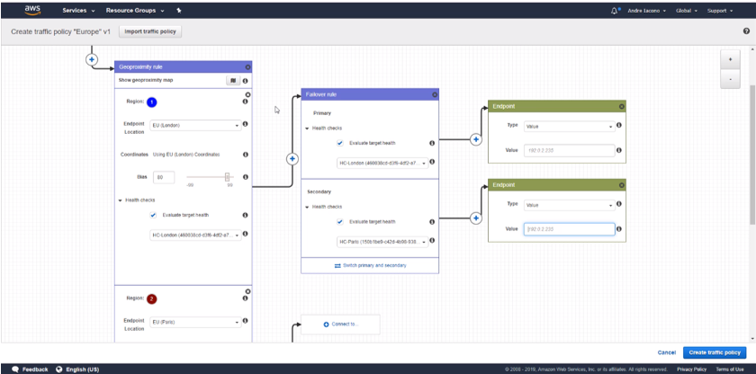
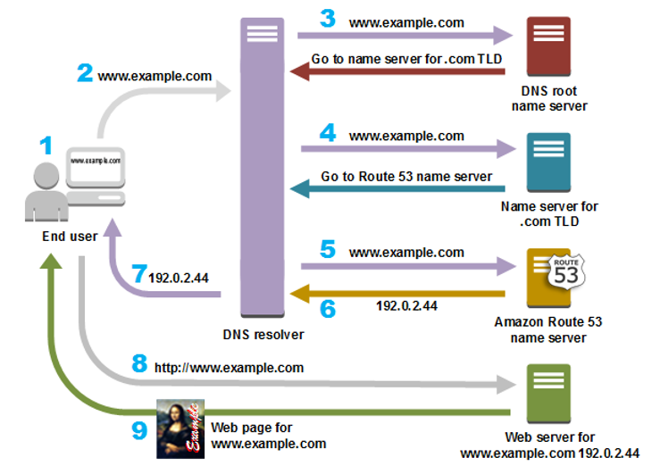
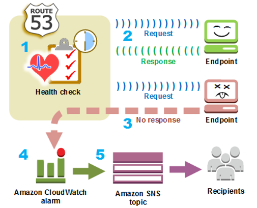

# Route 53

Pode ser utilizado para 3 coisas: registrar domínios, roteamento de DNS e verificação de integridade.

DNS é um de-para de um nome amigável de hostname para um endereço IP.

> www.google.com = 172.217.18.36

---

## DNS Records

* **A**: de-para de URL para IPv4
* **AAAA**: de-para de URL para IPv6
* **CNAME**: de-para de URL para URL
* **Alias**: de-para de URL para Recurso AWS (mais performático que CNAME).

---

## Routing Policy

* **Simple:** distribui uma requisição para cada servidor aleatoriamente e não possui `health check` (continua enviando tráfego para instâncias unhealth)

* **Failover:** se um servidor ficar indisponível, o tráfego é direcionado para outro (você define o primary e o secondary server)

* **Geolocation:** se baseia na localização do usuário para direcioná-lo para o servidor. Você pode rotear acessos de clientes baseando-se no continente ou país originador da requisição, ideal para direcionar requisições de brasileiros para servers no Brasil, de espanhois para servers na Espanha, etc

* **Geoproximity (trafic flow only):** roteia o acesso com base no local de seus recursos AWS, levando em conta a distância física

* **Latency-based:** roteia o tráfego para o servidor com menor latência

* **Multivalue Answer:** mesma coisa do Simple Routing, mas possui health checks

* **Weighted:** peso, você pode direcionar 80% do tráfego para um server, 15% para outro e 5% para outro. Os pesos são qualquer número entre 0 e 255. Você pode associar a esse routing policy um health check para não direcionar tráfego para instâncias incapacitadas.

Você pode criar um routing policy do tipo Alias para rotear o tráfego para o seu load balancer (ou CloudFront, no caso de site estático do S3).

---

## Traffic Flow

Você consegue desenhar todo o fluxo de tráfego e serializar vários Routing Policies atpe chegar no endpoint do tráfego (EC2, S3,...). Esse tipo de `Custom Policy` é cobrado ($/mês).

---

## Funcionamento do Route 53

---

## Verificação de Integridade

Você cria uma verificação de integridade e especifica os valores que definem como deseja que a verificação funcione, como o seguinte:

* O endereço IP ou nome de domínio do endpoint (para web server, por exemplo)

* O protocolo que você deseja que o Route 53 use para realizar a verificação (HTTP, HTTPS ou TCP)

* Com que frequência você deseja que o Route 53 envie uma solicitação ao endpoint (intervalo de solicitação)

* Quantas vezes consecutivas o endpoint deve deixar de responder as solicitações para que o Route 53 o classifique como Unhealth

* Opcionalmente, como você deseja ser notificado quando o Route 53 detectar que o endpoint está com problemas. Quando você configura uma notificação, o Route 53 define automaticamente um alarm do CloudWatch. O CloudWatch usa o SNS para notificar usuários que um endpoint está com problemas.

---

## Tempo de Vida (TTL)

Tempo em segundos pelo qual o resolvedor de DNS armazena em cache os valores de um registro antes de enviar uma solicitação adicional ao Route 53 para obter os valores atuais desse registro. Um TTL mais longo reduz as cobranças do Route 53, que são parcialmente baseadas no número de consultas DNS respondidas pelo Route 53. Um TTL mais curto reduz o tempo que os resolvedores de DNS roteiam o tráfego para recursos antigos depois que você altera os valores em um registro, por exemplo, alterando o IP do seu servidor web.

---

## Definição do preço

* **Gerenciamento de Zonas Hospedadas:** você paga um encargo mensal para cada zona hospedada gerenciada com o Route 53 --> 0,50 USD por zona hospedada/mês, para as primeiras 25 zonas, as adicionais custam 0,10 USD/mês por zona (uma zona hospedada excluída em até 12h após a sua criação não é cobrada - para fins de teste)

* **Atendimento a consultas do DNS:** cobrança associada a cada consulta do DNS respondida pelo Route 53, exceto para consultas a registros `Alias A` mapeadas para instâncias do Elastic Load Balancer, distribuições do CLoudFront, ambientes do AWS Elastic Beanstalk, API Gateways, VPC Endpoints ou Buckets do Site do S3, fornecidas gratuitamente e cobrado um valor X USD por milhão de consultas/mês, sendo que o tipo de routing policy afeta o preço. Consultas padrão = 0,40 USD por milhão de consultas/mês e consultas de roteamento baseado em latência = 0,60 USD por milhão de consultas/mês. Consultas de Alias são gratuitas (para rotear para recursos AWS)

* **Gerenciamento de nomes de domínio:** taxa anual para cada nome de domínio registrado pelo ou transferido para o Route 53.