# VPC - Virtual Private Cloud

VPC é criado dentro de uma Region e Subnet é criada dentro de uma AZ.

`Custom VPC` é aquela criada pelo cliente. AWS fornece o `Default VPC` para todas as contas criadas.

`Default VPC` possui acesso a internet (public).

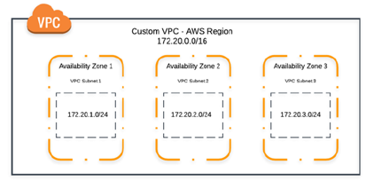

---

## Definições

* **VPC:** uma rede virtual dedicada à sua conta AWS
* **Subnet:** um intervalo de endereços IP na VPC
* **Route Tables:** conjunto de regras, chamadas de rotas, que são usadas para determinar para onde o tráfego de rede será direcionado
* **Internet Gateway:** um gateway que você anexa à VPC para permitir a comunicação entre recursos na VPC e a internet
* **Bloco CIDR:** roteamento sem classe entre domínios. Uma metodologia de alocação de endereço de protocolo de internet e agregação de rota
* **NAT Gateway:** um serviço gerenciado da AWS que permite que as instâncias do EC2 em subnets privadas se conectem à internet, a outras VPCs ou a redes on-premises
* **Network ACLs:** uma camada de segurança opcional para a VPC que atua como um firewall para controlar o tráfego de entrada e saída em sub redes

---

## Preço

Não há cobrança pelo uso do VPC, apenas por alguns recursos associados a esse assunto.

* **NAT Gateway:** cobrado por cada hora em que ele estiver disponível. Você é cobrado por GB de dados processados pelo NAT Gateway
* **Interface de Rede Elástica (ENI):** se você escolher habilitar o espelhamento de tráfego na ENI de instâncias EC2, pagará por cada ENI habilitada com espelhamento de tráfego. Você é cobrado por hora de ENI habilitada.

---

## Subnets

* **Auto-assign IP settings:** esta opção permite que você defina a atribuição automática das configurações de IP para solicitar automaticamente um endereço IPv4 ou IPv6 público para uma nova interface de rede nesta subnet
* **Configurações de nomes baseados em recursos (RBN):** permite que você espeecifique o tipo de nome do host para as instâncias do EC2 nesta subnet e configure as consultas de registros DNS A e AAAA são geridas

OS primeiros quatro endereços IP e o último estão indisponíveis para uso em cada bloco CIDR de subnet. Usando o bloco 10.0.0.0/24 como exemplo:

* `10.0.0.0`: endereço de rede
* `10.0.0.1`: reservado pela AWS para o roteador da VPC
* `10.0.0.2`: reservado pela AWS para o servidor DNS
* `10.0.0.3`: reservado pela AWS para o futuro
* `10.0.0.255`: endereço de transmissão de rede

---

## Route Tables

Uma tabela de rotas contém um conjunto de regras chamado de rotas, as quais são usadas para determinar para onde o tráfego de rede da VPC é direcionado. Você pode associar explicitamente uma subnet a uma route table de rotas específicas, caso contrário, a subnet é implicitamente associada à tabela de rotas principal.

* **Tabela de rotas principal:** vem automaticamente com a VPC. Ela controla o roteamento de todas as subnets que não estejam explicitamente associadas com outra tabela de rotas
* **Tabela de rotas personalizada:** uma tabela de rotas criada para a VPC
* **Destination:** o intervalo de endereços IP para onde você deseja que o tráfego vá
* **Target:** o gateway, a interface de rede ou a conexão por meio da qual enviar o tráfego de destino

Uma subnet só pode ser associada a uma única tabela de rotas por vez, mas é possível associar várias subnets a uma mesma tabela de rotas.

Por padrão, uma tabela de rotas personalizada fica vazia e você adiciona rotas conforme necessário.

* **Tabela de rotas de gateway:** você pode associar uma tabela de rotas a um gateway da internet ou a um gateway privado virtual. Quando uma route table é associada a um gaeway, ela é chamada de tabela de rotas de gateway

* **Prioridade de rotas:** as rotas para endereços IPv4 e IPv6 ou blocos CIDR são independentes umas das outras. As rotas são lidas em ordem numérica e a primera regra satisfeita é que direciona o tráfego. Por exemplo, se uma requisição chegar no VPC a partir do IP 172.31.0.1, ele será direcionado para a rota "pcx-...", embora também satisfaça a rota nº 3.

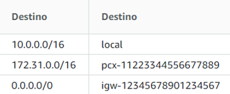

* **Boas práticas:** AWS recomenda criar seus Números de Regras em incrementos de 100, para o caso de precisar inserir novas rotas entre uma e outra com a prioridade apropriada.

Exemplo de uma route table para uma subnet privada que eu criei: só é permitido acesso originado na rede `10.1.0.0/16` (meu VPC).

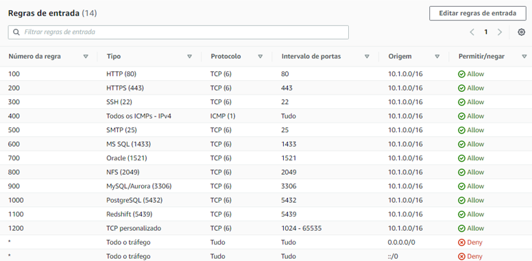

Filtrar o máximo de tráfego possível, não manter as portas abertas para a internet.

Para se conectar com servidores via SSH, é preciso habilitar as portas `1.024-65.535`, como consta na rota nº 1.200 acima. Isso é preciso por conta dessas portas serem `portas efêmeras` (portas dinâmicas).

---

## Emparelhamento de VPCs

**VPC Peer:** emparelhamento que você pode habilitar entre duas VPCs para que elas façam parte de uma mesma rede.

* Utiliza o conceito de `No transit`, de forma que um VPC só acesso o outro de forma direta, sem poder "cortar caminho" por uma rede comum. Por exemplo, considere os três VPCs: VPC Itaú, VPC Rede e VPC Zup. Se habilitarmos Peer VPC entre VPC Itaú e VPC Rede e habilitarmos Peer VPC entre VPC Rede e VPC Zup, o VPC Itaú não terá acesso ao VPC Zup, não é possível que o Itaú utilize o VPC Rede como intermediário de conexão, é preciso habilitar o Peer VPC entre VPC Itaú e VPC Zup para emparelhar redes.

* O custo de emparelhamento de rede é dado pelo volume de dados transferidos entre AZs ou Regions

* Não é possível ter mais de um Peer VPC entre dois VPCs (por exemplo, se já existe um Peer VPC entre A e B, não é possível criar outro Peer VPC entre eles)

* Cada VPC pode emparelhar com outras 50 VPC, mas esse valor é ajustável para 125, é preciso acionar a AWS para aumentar o limite

---

## Segurança

Melhores práticas:

* Use várias implantações de AZs para ter alta disponibilidade
* Use grupos de segurança e network ACLs
* Use políticas do IAM para controlar o acesso
* Use o Amazon CloudWatch para monitorar seus componantes da VPC e conexões VPN
* Use logs de fluxo para capturar informações sobre o tráfego IP de e para as interfaces de rede na VPC

---

## Security Groups

* Você pode especificar regras de permissão, mas não regras de negação
* Você pode especificar regras separadas para o tráfego de entrada e de saída
* As regras do SG permitem filtrar o tráfego com base em protocolos e números de porta
* Security Group é `statefull`: se você enviar uma solicitação da instância, o tráfego da resposta dessa solicitação terá permissão para fluir, independentemente das regras de saída do SG
* Por default, todo tráfego de entrada é bloqueado em um SG, com exceção do SG Padrão do VPC. Esse SG tem uma inbound rule que permite todo o tráfego de entrada vindo dele mesmo (permitindo comunicação entre máquinas que usem o default security group)
* Por default, todo tráfego de saída é liberado

---

## Network Access Control List (NACL)

Por padrão, a VPC tem uma Network ACL padrão modificável que permite todos os tráfegos de IPv4 de entrada e saída e, se aplicável, o tráfego de IPv6.

Você pode criar uma Network ACL personalizada e associá-la a uma subnet. Por padrão, a NACL personalizada negará todo e qualquer tráfego de entrada e saída.

Toda subnet precisa ser associada a uma NACL. Se você não associar explicitamente uma subnet a NACL, ela será associada automaticamente com a NACL padrão.

É possível associar uma NACL a várias subnets mas só é possível associar uma subnet a uma NACL por vez.

NACL é `stateless`, o que significa que as respostas para o tráfego de entrada permitido estão sujeitas às regras para o tráfego de saída (e vice-versa).

---

## VPC FLow Logs

Captura informações sobre o tráfego de IP de e para as interfaces de rede em sua VPC. É possível criar um log de fluxos para uma VPC, subnet ou interface de rede. Os dados de log de fluxo são publicados no CloudWatch ou no Amazon S3.

Boas práticas: crie um flow log para o que recebeu "allow" e outro para tráfegos que receberam "deny".

---

## NAT Gateway

Netweork Access Transalator Gateway = faz o de-para de endereços privados para públicos.

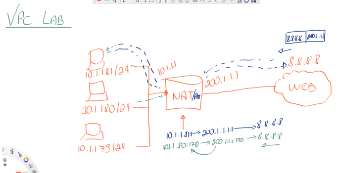

É possível monitorar o NAT Gateway com CloudWatch Logs em tempo real.

Esse recurso permite que instâncias em subnets privadas (instâncias sem IP público) acessem a internet. A requisição sai do VPC com o IP do NAT, ele manda a requisição para a internet e devolve a resposta para o IP privado (instância) que originou a requisição.

Outra forma de instâncias sem IP público acessarem a internet é via Gateway Virtual Privado em uma conexão de VPN ou Direct Connect.

---

## Conectar a VPC a Redes Remotas

É possível conectar sua VPC a redes e usuários remotos usando as opções de conectividade por VPN a seguir:

* **AWS Site-to-Site VPN:** cria uma conexão VPN de IPsec (Internet Protocol Security) entre sua VPC e sua rede remota. No lado da AWS da conexão da Site-to-Site VPN, um gateway privado virtual ou um gateway de trânsito fornece dois endpoints de VPN (túneis) para fins de failover automático. Ocorre criptografia in-transit;

* **AWS Client VPN:** é um serviço baseado no cliente que protege o acesso aos recursos AWS ou a sua rede on-premises. Com o AWS Client VPN, é possível configurar um endpoint para garantir a segurança da conexão de clientes por meio de uma sessão de VPN com TLS. Isso permite que os clientes acessem na AWS ou on-premises de qualquer lugar usando um cliente de VPN baseado em OpenVPN;

* **AWS VPN CloudHub:** se tiver mais de uma rede remota (por exemplo, várias filiais), você poderá criar várias conexões AWS Site-to-Site VPN por meio do gateway privado virtual, permitindo a comunicação entre as redes. O VPN CloudHub opera em um modelo simples de hub e spoke que pode ser usado com ou sem uma VPC;

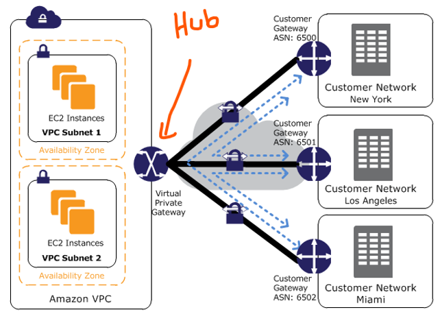

* **Dispositivo VPN de software terceirizado:** você pode criar uma conexão VPN para sua rede remota usando uma instância EC2 na VPC que está executando um dispositivo de VPN de software de terceiros. A AWS não fornece nem mantém dispositivos de VPN de terceiros, mas é possível escolher uma opção entre os diversos produtos fornecidos por parceiros e comunidades de código aberto.

Você também pode usar o `AWS Direct Connect` para criar uma conexão privada de uma rede remota para a VPC. Combine essa conexão com o AWS Site-to-Site VPN para criar uma conexão criptografada IPsec.

---

## Conectar sua VPC a outros serviços AWS

O `AWS PrivateLink` estabelece conectividade privada entre VPCs e serviços hospedados na AWS ou on-premises, sem expor o tráfego entre sua VPC e o serviço na internet.

Para usar o AWS PrivateLink, é preciso criar um endpoint da VPC. Isso cria uma interface de rede elástica (ENI) na sua subnet com um endereço IP privado que serve como ponto de entrada para o tráfego destinado ao serviço.

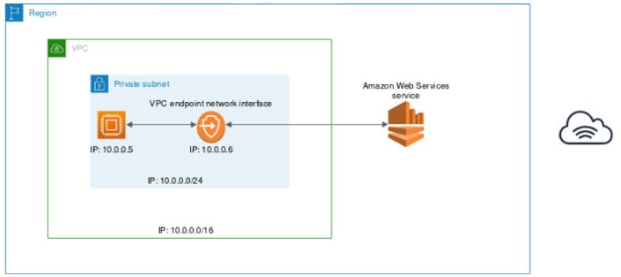

Você pode criar seu próprio endpoint da VPC habilitado pelo AWS PrivateLink e permitir que outros clientes da AWS acessem o mesmo serviço.

Usando o AWS PrivateLink você não precisa usar um gateway de internet, um dispositivo NAT, um endereço IP público, uma conexão do AWS Direct Connect ou uma conexão Site-to-Site VPN para se comunicar com o serviço.

**Tipos de Endpoint**

* Endpoint de Gateway: funciona como destino para uma rota no route table. Suporta S3 e DynamoDB e é grátis;
* Endpoint de Interface: desenvolvido pelo AWS PrivateLink e usam uma ENI como ponto de entrada para o tráfego destinado ao serviço. Normalmente são acessados usando o nome de DNS público ou privado associado ao serviço.

---

## Outras definições

* **Virtual Private Gateway:** o lado da Amazon VPC de uma conexão VPN;

* Os pacotes que se original na rede AWS com destino a própria rede AWS, utilizam a rede privada AWS, não passando pela internet. Por isso, se você tiver duas instâncias com IP público tentando se comunicar, o tráfego não passará pela internet, exceto para o tráfego de ou para as regions da AWS China;

* Além disso, todos os dados que passam pela rede global da AWS que interconectam os data centers e regions são criptografados automaticamente na camada física antes de sair das instalações;

* Filtragem statefull = monitora a origem de uma solicitação e pode permitir automaticamente que a resposta à solicitação seja devolvida para o computador de origem;

* Filtragem stateless = analisa somente o endereço IP de origem e destino, e a porta de destino, ignorando se o tráfego é uma nova solicitação ou uma nova resposta a uma solicitação.

---

## Direct Connect (DX)

Provê uma conexão privada dedicada de sua rede remota a sua VPC.

Conexão dedicada deve ser configurada entre o seu Data Center e o AWS Direct Connect Locations.

Você precisa configurar um Virtual Private Gateway na sua VPC.

Acesse recursos públicos (S3) e privados (EC2) na mesma conexão.

**Use Cases:**

* Aumento de throughput de banda de rede - trabalhando com grandes data sets, baixo custo
* Experiencia de rede mais consistente
* Ambientes híbridos (on prem + cloud)
* Suporta IPv4 e IPv6

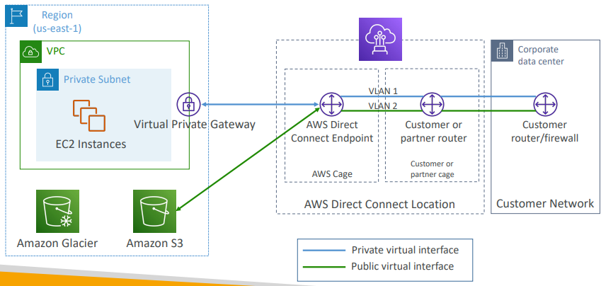

Se a intenção for configurar o Direct Connect para uma ou mais VPCs em diferentes regions (mesma conta), deve-se isar o `Direct Connect Gateway`.

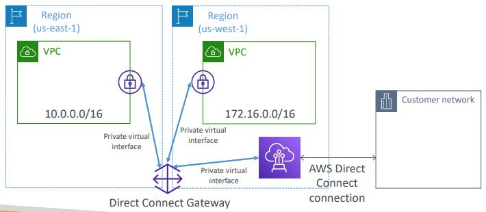

**Tipos de conexão:**

* Dedicated Connections
    * Capacidade de 1 Gbps, 10 Gbps e 100 Gbps;
    * Porta física de internet dedicada ao cliente
    * Requisição feita primeira a AWS, então é finalizada por um parceiro AWS de Direct Connect
* Hosted Connections
    * 50 Mbps, 500 Mbps e 10 Gbps
    * Conexão requisistada via AWS Direct Connect Partners
    * Capacidade pode ser adicionada ou removida sob demanda

Lead Time de configuração geralmente demora mais que 1 mês para estabelecer uma nova conexão.

**Encryption**

Dados em trânsito não são criptografados, mas são privados.

AWS Direct Connect + VPN provê um `IPsec-encrypted` conexão privada.

Em caso de falhas no Direct Connect, você pode configurar uma backup do Direct Connect (caro), ou um Site-to-Site VPN connection.

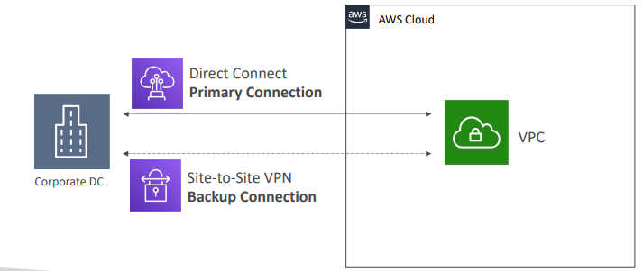

---

## Transit Gateway

Te ajuda em cenários complexos onde há conexão de diversas VPCs, on-premises, hub-and-spoke (Star) connection e etc. Centraliza a gestão de conexões.

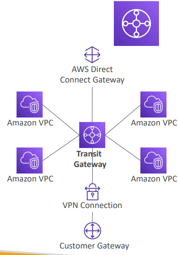

* Recurso regional, mas pode trabalhar em cross-region
* É possível emparelhar Transit Gateways através das regions
* Route Tables: limita o quanto uma VPC pode se comunicar com outra
* Trabalha com Direct Connect Gateway, VPN Connections
* Suporta `IP Multicast` (não suportado por nenhum outro serviço AWS)

---

## VPC Traffic Mirroring

Te habilita a capturar e inspecionar o tráfego de rede na sua VPC.

* Roteia o tráfego para dispositivos de segurança que você gerencia
* Captura o tráfego:
    * From (Source) - ENIs
    * To (Targets) - uma ENI ou NLB
* Captura todos os pacotes ou apenas os de interesse
* Source e Target podem estar na mesma VPC ou em VPCs diferentes (peering)
* Use Cases: inspeção de conteúdo, threat monitoring

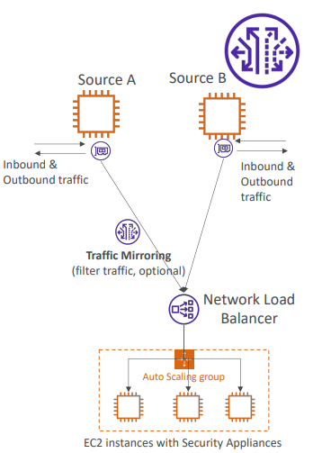

---

## AWS Network Firewall

Protege toda a sua VPC.

* Da layer 3 a layer 7
* Em qualquer direção, você pode inspecionar
    * tráfego entre VPCs
    * Outbound para a Internet
    * Inbound da Internet
    * De/ Para Direct Connect e Site-to-Site VPN

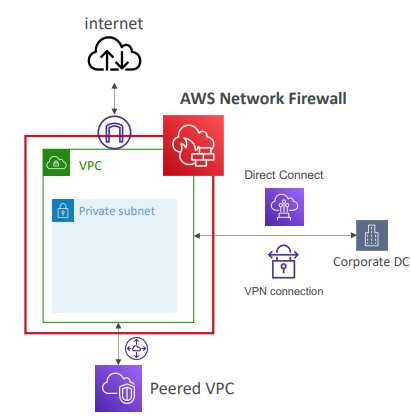

Suporta milhares de regras:

* IP e Portas
* Protocolo
* lista de domínio Statefull (ex.: apenas libere tráfego de saída para `*.mycorp.com` ou repositórios de software de terceiros)

**Traffic Filtering:** allow, drop ou alert para o tráfego que da match com as rules.